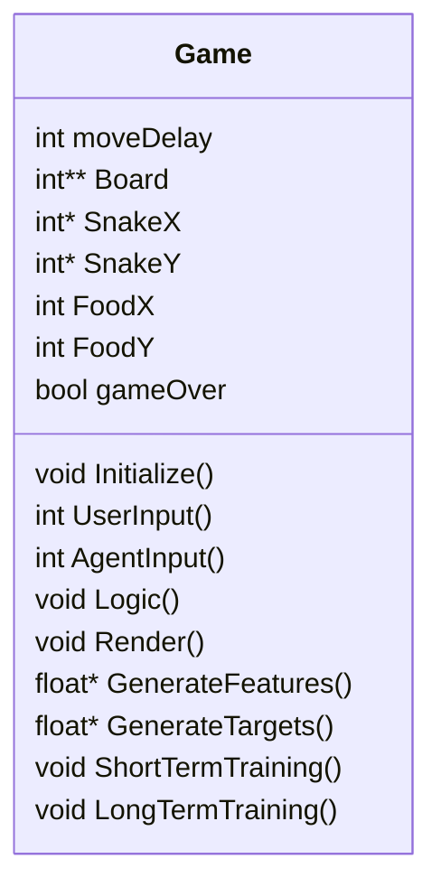
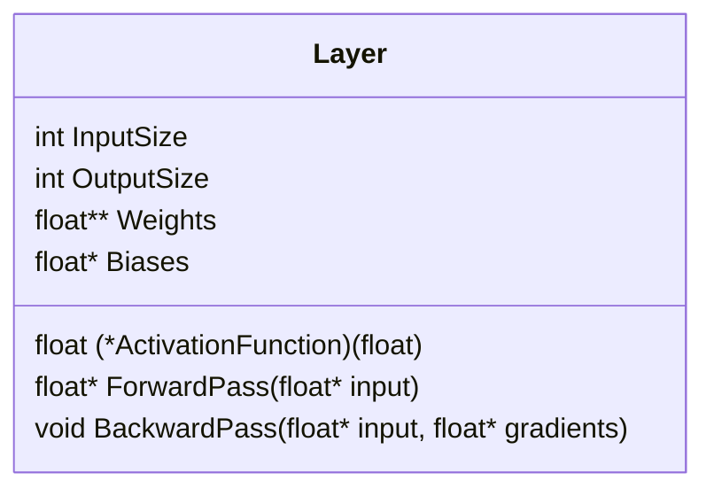
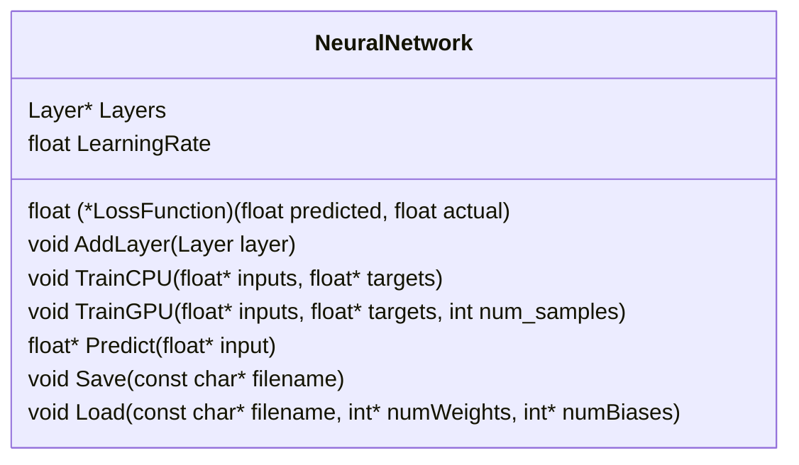
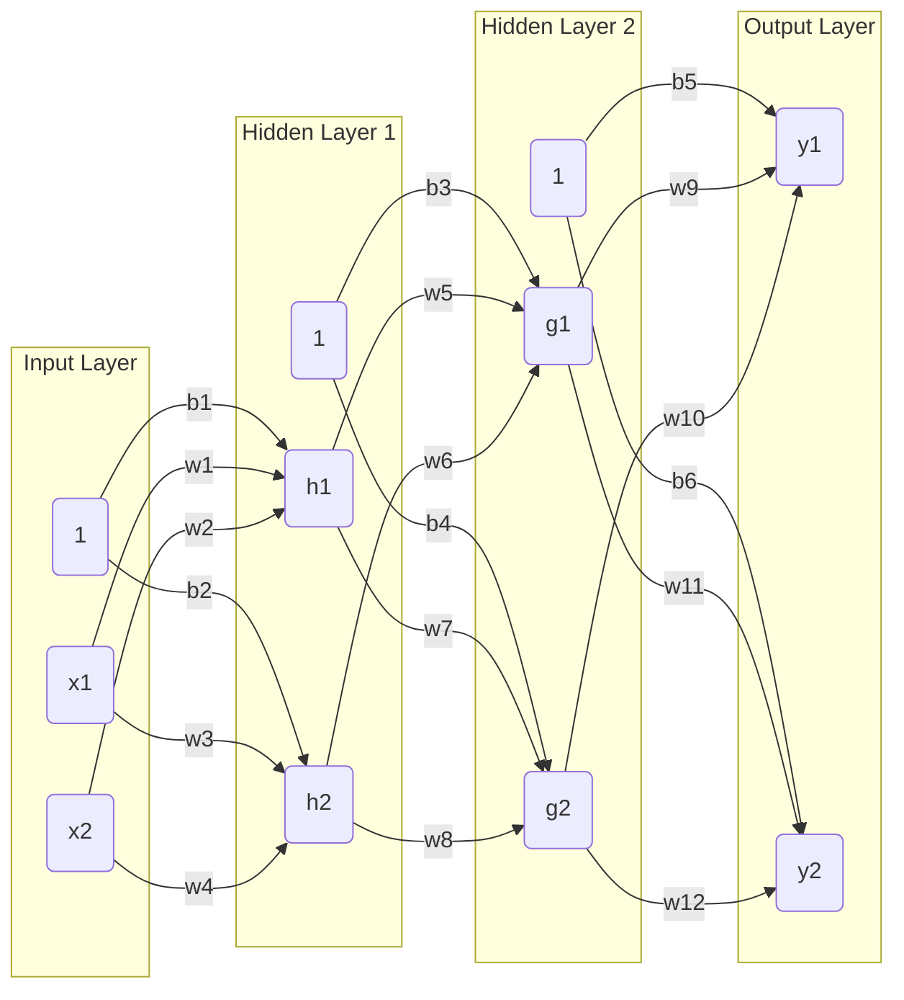

# Reinforcement Learning Snake Game from Scratch in C accelerated by CUDA

## Introduction
This project demonstrates how to train an AI agent to play the classic snake game using deep reinforcement learning. This code for this project was written in C and the CUDA framework was used to extend this program's capability to use NVIDIA GPUs for training. The choice to use C over C++ for this project was deliberate to gain a further understanding of deep reinforcement learning by coding everything from scratch and having to deal with direct memory management. Even though C does not have classes, structs were used to organize the code, allowing for a semblance of object-oriented programming principles to be incorporated into this project.

## Game Modes
- **Normal Mode:** Allows User to Play the Game Normally
- **Training Mode:** Allows user to see the AI Agent being trained in realtime.
- **AI Mode:** Allows user to select a pretrained agent and see it play the game.

## Game Class


## Layer Class


## Neural Network Class


## Deep Reinforcement Learning

### Bellman Equation

$$
Q_{\text{updated}}(s,a) = Q(s,a) + \alpha \cdot \left[R(s,a) + \gamma \cdot \text{max}_{a'}Q(s',a') - Q(s,a)\right]
$$

where
- $Q_{\text{updated}}(s,a)$ is updated q_value for the current state-action pair.
- $Q(s,a)$ is the current q_value for the next state-action pair.
- $\text{max}_{a'}Q(s',a')$ is the maximum expected future reward observed at the next-state $s'$, across all possible actions $a'$.
- $\alpha$ is the learning rate.
- $R(s,a)$ is the reward received after taking action $a$ in state $s$.
- $\gamma$ is the discount factor.

### Simplified Bellman Equation

$$Q(s,a) = \text{model.predict}(s,a)$$

$$Q_{\text{updated}}(s,a) = R + \gamma \cdot \max_{a'}Q(s',a')$$

*Note: The simplified Bellman Equation is equivalent to the case where $\alpha = 1$.*

### Deep Q-Learning Training Algorithm
```python
while not game_over:
    # Get Current State
    current_state = get_state()

    # Predict Q values for the current state (one q_val for each action)
    current_qvals = model.predict(current_state)

    # Choose an action based on current q_values
    # Could be at random at the beginning of the highest q-value later in training
    action = choose_action(current_qvals)

    # Calculate Reward
    reward = calculateReward()

    # Update game_over value depending on what happened with the last action
    game_over = updateGameOver()

    # Take the action
    take_action(action)

    # Predict Q values for the next state
    next_state = get_state()

    # Predict Q values for the next state (one q_val for each action)
    next_qvals = model.predict(next_state)

    # IF the game is over, the target Q value is the reward
    if game_over:
        current_qvals[action] = reward
    else:
        current_qvals[action] = reward + gamma * max(next_qvals)

    # Train the model on the updated Q values
    model.train(current_state, current_qvals)
```

*Note: Apart from training the AI Agent after every move, the AI Agent will also take advantage of GPU acceleration with CUDA every n moves with a larger batch of training examples.*

## Neural Network Inputs
The model used in deep reinforcement learning is a simple fully connected feed-forward neural network. This neural network collects the following 12 features after every move:
1. Score: The score of the game which is equal to the length of the snake.
2. Danger_UP: Binary flag indicating if there is a wall or a part of the snake directly above the snake's head.
3. Danger_LEFT: Binary flag indicating if there is a wall or a part of the snake to the immediate left of the snake's head.
4. Danger_RIGHT: Binary flag indicating if there is a wall or a part of the snake to the immediate right of the snake's head.
5. Direction_UP: Binary flag indicating if the snake is currently moving up.
6. Direction_DOWN: Binary flag indicating if the snake is currently moving down.
7. Direction_LEFT: Binary flag indicating if the snake is currently moving left.
8. Direction_RIGHT: Binary flag indicating if the snake is currently moving right.
9. Food_UP: Binary flag indicating if the food is above the snake.
10. Food_DOWN: Binary flag indicating if the food is below the snake.
11. Food_LEFT: Binary flag indicating if the food is to the left of the snake.
12. Food_RIGHT: Binary flag indicating if the food is to the right of the snake.

## Neural Network Outputs
The neural network used in this project will have 3 outputs. The output would be one q_value corresponding to each of the four directions the snake can move, given the current game state the snake is in. At the beginning of training, the snake will make random moves, but after a specified number of training iterations, the neural network to determine its next move. The outputs to the neural network are the following:
1. Q_Value_UP
2. Q_Value_Left
3. Q_Value_Right

## Forward Propagation
Forward propagation is the algorithm used to calculate a prediction based on the inputs given to the neural network. To understand how the neural network performs forward propagation, the following diagram of a very simple neural network is shown below

The forward propagation algorithm is fairly simple in nature. Each neuron in a hidden layer (denoted by $h$ and $g$) in the illustration above takes in the weighted sum of each input, adds the bias term, and then passes it through an activation function. Given an activation function $\sigma$ for all layers, one can break down the forward propagation algorithm with the following equations:

$$
h_1 = \sigma(w_1 x_1 + w_2 x_2 + b_1)
$$

$$
h_2 = \sigma(w_3 x_1 + w_4 x_2 + b_2)
$$

$$
g_1 = \sigma(w_5 h_1 + w_6 h_2 + b_3)
$$

$$
g_2 = \sigma(w_7 h_1 + w_8 h_2 + b_4)
$$

$$
y_1 = \sigma(w_9 g_1 + w_{10} g_2 + b_5)
$$

$$
y_2 = \sigma(w_{11} g_1 + w_{12} g_2 + b_6)
$$

**Note: A neural network that is as small as the one visualized above, can easily be broken down with equations, but it is nearly impossible to do so with practical neural networks that have millions of weights and biases.**

## Backward Propagation
Backward Propagation is the algorithm used to update the Neural Network's weights and biases such that they minimize the loss through multiple epochs of training. For the sake of explanation, lets assume that our activation function is

$$\sigma(x) = \frac{1}{1 + e^{-x}}$$

and that the derivative of our activation function is

$$\frac{d}{dx}\sigma(x) = \sigma(x) (1 - \sigma(x))$$

and our loss function is

$$MSE = \frac{1}{n} \sum_{i=1}^{n} (\hat{y}_i - y_i)^2$$

and the derivative of our loss function is

$$\frac{\partial}{\partial \hat{y_i}} MSE= \frac{2}{n} \sum_{i=1}^n (\hat{y_i} - y_i)$$

The backpropagation algorithm calculates the derivative of the loss with respect to each weight. This algorithm starts by calculating the derivatives for the weights of the last layer, and then uses those results to calculate the derivatives of the weights in previous layers. The reason for doing this is that since forward propagation uses compositive functions, their derivatives can be calculated using the chain rule. Calculating the derivative of the loss with respect to a weight on the last layer can be calculated as follow

which can be expanded to

$$\frac{\partial}{\partial w_{12}} MSE = \frac{2}{n} \sum_{i=1}^n (y_i - \sigma(w_{11}g_1 + w_{12}g_2 + b_6))$$

$$\times \sigma(w_{11} g_{1} + w_{12} g_2 + b_6)$$

$$\times (1 - \sigma(w_{11} g_1 + w_{12} g_2 + b_6))$$

$$\times g_2$$

*Note: In the case of multiple outputs, the total loss is the sum of the loss of each output.*

$$

\frac{\partial}{\partial w_{12}} MSE = \frac{\partial}{\partial w_{12}} MSE(y_1, \hat{y_1}) + \frac{\partial}{\partial w_{12}} MSE(y_2, \hat{y_2})
$$


```python
def backpropagation():
```

# Cuda Acceleration

## Results

## Hardware Used
- Saturn Cloud... Google Colab, etc???

## References
- Patric Loeber's PyGame inspiration
- https://www.freecodecamp.org/news/diving-deeper-into-reinforcement-learning-with-q-learning-c18d0db58efe/
