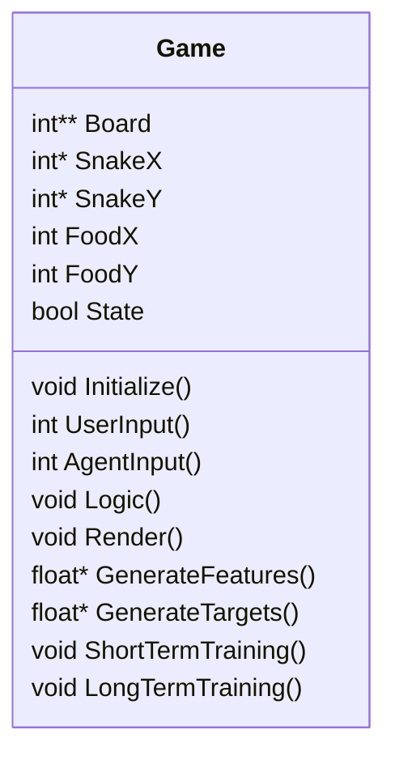
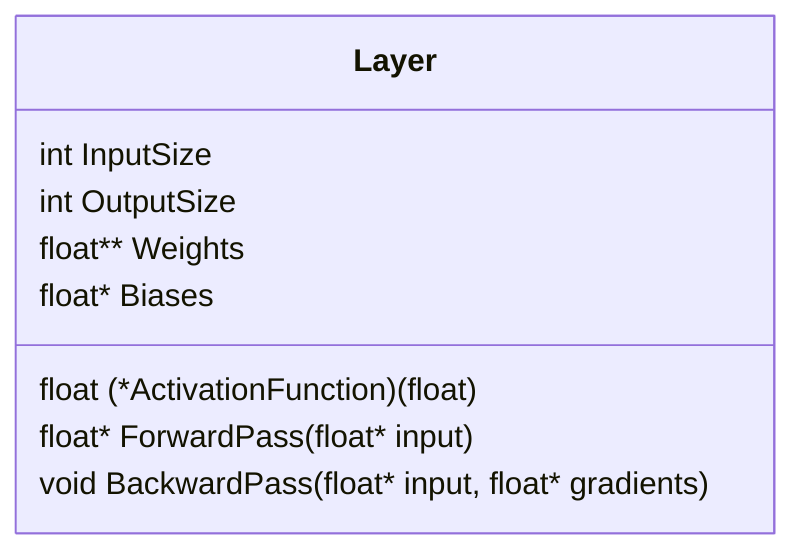
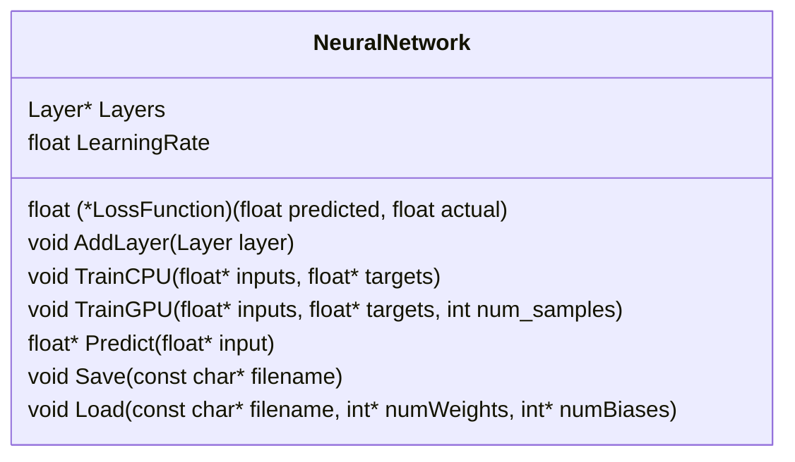
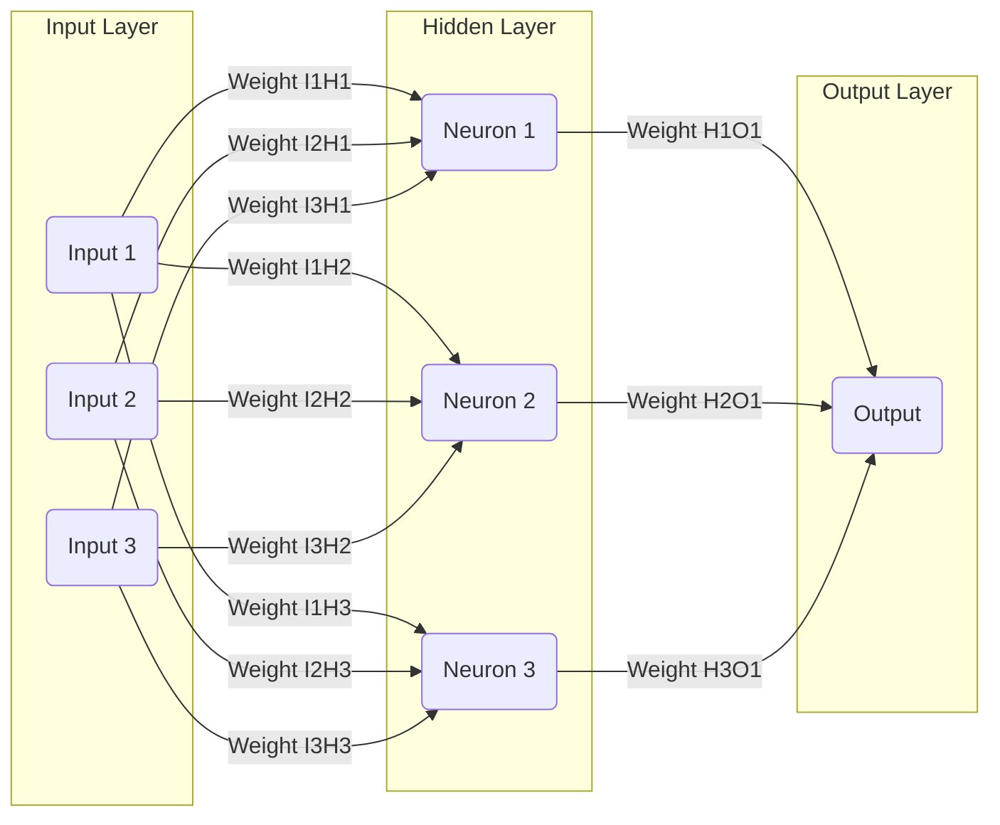

# Reinforcement Learning Snake Game from Scratch in C accelerated by CUDA

## Demonstration

## Introduction

## Game Modes
- **Normal Mode:** Allows User to Play the Game Normally
- **Training Mode:** Allows user to see the AI Agent being trained in realtime.
- **AI Mode:** Allows user to select a pretrained agent and see it play the game.

## Game Class

## Layer Class

## Neural Network Class

## Deep Reinforcement Learning
Bellman Equations

$$Q_{\text{new}}(s, a) = Q(s, a) + \alpha \left[R(s, a) + \gamma \max_{a'} Q(s', a') - Q(s, a)\right]$$

- $Q_{\text{new}}(s, a)$ is the new $Q$ value for a given state-action pair.
- $Q(s, a)$ is the current $Q$ value given the current state-action pair.
- $\alpha$ is the learning rate.
- $R(s, a)$ is the reward received after taking action $a$ in state $s$.
- $\gamma$ is the discount factor.
- $\max_{a'} Q(s', a')$ is the maximum expected future reward observed at the new state $s'$, across all possible actions $a'$.

## Hardware Used
- Saturn Cloud... Google Colab, etc???

## References
- Patric Loeber's PyGame inspiration
- CUDA course by...
