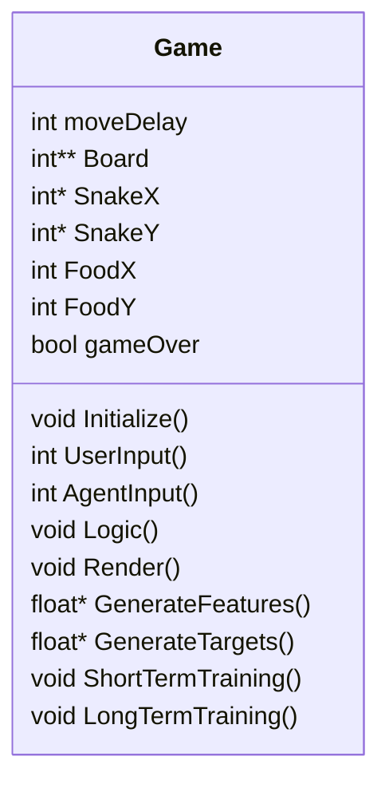
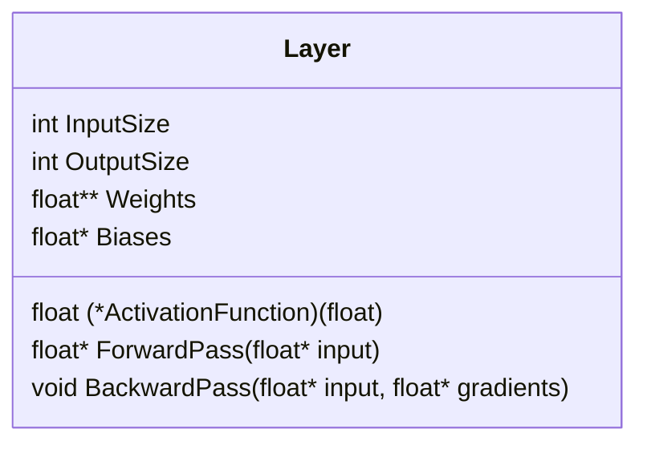
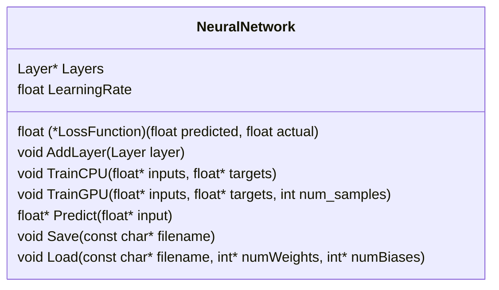
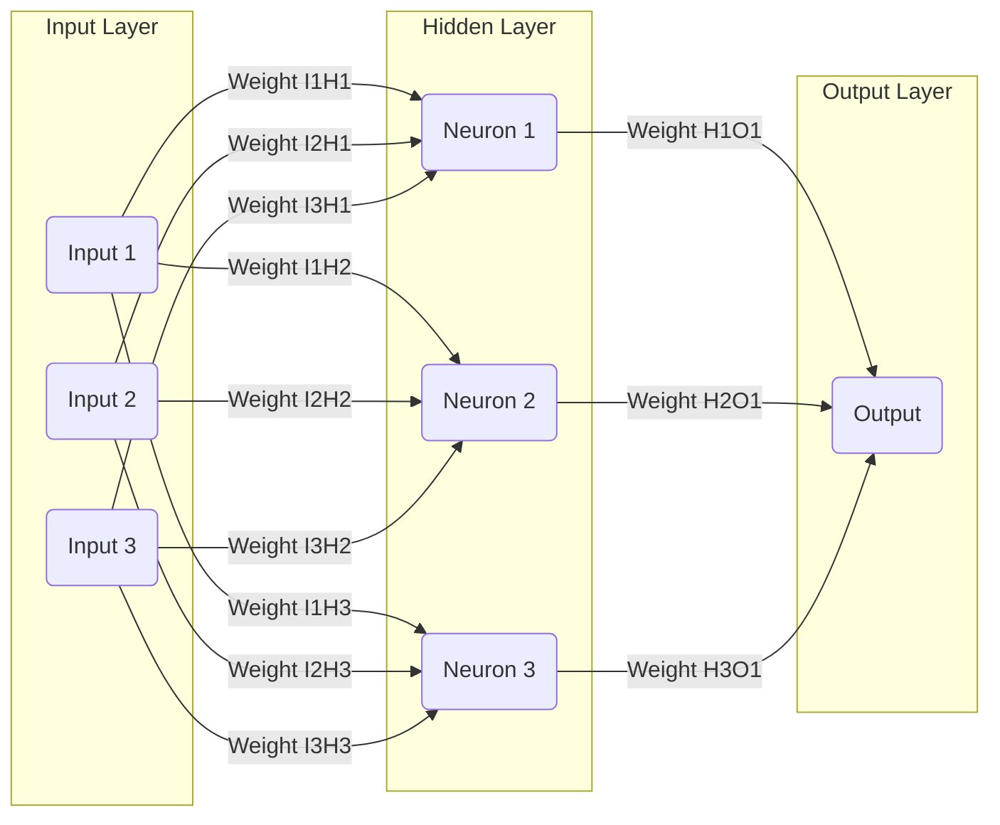

# Reinforcement Learning Snake Game from Scratch in C accelerated by CUDA

## Introduction
This project demonstrates how to train an AI agent to play the classic snake game using deep reinforcement learning. This code for this project was written in C and the CUDA framework was used to extend this program's capability to use NVIDIA GPUs for training. The choice to use C over C++ for this project was deliberate to gain a further understanding of deep reinforcement learning by coding everything from scratch and having to deal with direct memory management. Even though C does not have classes, structs were used to organize the code, allowing for a semblance of object-oriented programming principles to be incorporated into this project.

## Game Modes
- **Normal Mode:** Allows User to Play the Game Normally
- **Training Mode:** Allows user to see the AI Agent being trained in realtime.
- **AI Mode:** Allows user to select a pretrained agent and see it play the game.

## Game Class


## Layer Class


## Neural Network Class


## Deep Reinforcement Learning
### Bellman Equation
$$Q_{\text{new}}(s, a) = Q_{\text{current}}(s, a) + \alpha \left[R(s, a) + \gamma \max_{a'} Q_{\text{new}}(s', a') - Q_{\text{current}}(s, a)\right]$$

- $Q_{\text{new}}(s, a)$ is the new $Q$ value for a given state-action pair.
- $Q_{\text{current}}(s, a)$ is the current $Q$ value for the current state-action pair.
- $\alpha$ is the learning rate.
- $R(s, a)$ is the reward received after taking action $a$ in state $s$.
- $\gamma$ is the discount factor.
- $\max_{a'} Q_{\text{new}}(s', a')$ is the maximum expected future reward observed at the new state $s'$, across all possible actions $a'$.

### Simplified Bellman Equation
$$Q_{\text{current}}(s) = \text{model.predict}(s)$$
$$Q_{\text{new}}(s) = R + \gamma \max(Q_{\text{current}}(s'))$$

### Deep Q-Learning Training Algorithm
```python
while not game_over:
    # Get Current State
    current_state = get_state()

    # Predict Q values for the current state (one q_val for each action)
    current_qvals = model.predict(current_state)

    # Choose an action based on current q_values
    # Could be at random at the beginning of the highest q-value later in training
    action = choose_action(current_qvals)

    # Update game_over value depending on what happened with the last action
    game_over = updateGameOver()

    # Take the action
    take_action(action)

    # Predict Q values for the next state
    next_state = get_state()

    # Predict Q values for the next state (one q_val for each action)
    next_qvals = model.predict(next_state)

    # IF the game is over, the target Q value is the reward
    if game_over:
        current_qvals[action] = target_val
    else:
        current_qvals[action] = reward + gamma * max(next_qvals)

    # Train the model on the updated Q values
    model.train(current_state, current_qvals)

    # Update the current state
    current_State = next_state
```
*Note: Apart from training the AI Agent after every move, the AI Agent will also take advantage of GPU acceleration with CUDA every n moves with a larger batch of training examples.*

## Neural Network Inputs
The model used in deep reinforcement learning is a simple fully connected feed-forward neural network. This neural network collects the following 12 features after every move:
1. Danger_UP: Binary flag indicating if there is a wall or a part of the snake directly above the snake's head.
2. Danger_DOWN: Binary flag indicating if there is a wall or a part of the snake directly below the snake's tail.
3. Danger_LEFT: Binary flag indicating if there is a wall or a part of the snake to the immediate left of the snake's head.
4. Danger_RIGHT: Binary flag indicating if there is a wall or a part of the snake to the immediate right of the snake's head.
5. Direction_UP: Binary flag indicating if the snake is currently moving up.
6. Direction_DOWN: Binary flag indicating if the snake is currently moving down.
7. Direction_LEFT: Binary flag indicating if the snake is currently moving left.
8. Direction_RIGHT: Binary flag indicating if the snake is currently moving right.
9. Food_UP: Binary flag indicating if the food is above the snake.
10. Food_DOWN: Binary flag indicating if the food is below the snake.
11. Food_LEFT: Binary flag indicating if the food is to the left the snake.
12. Food_RIGHT: Binary flag indicating if the food is to the right the snake.

## Neural Network Outputs
The neural network used in this project will have 4 outputs. The output would be one q_value corresponding to each of the four directions the snake can move, given the current game state the snake is in. At the beginning of training, the snake will make random moves, but will later use the neural network in order to determine its next move.

## Forward Propagation
Forward propagation is the algorithm used to calculate a prediction based on the inputs given to the neural network. To understand how the neural network performs forward propagation, the following diagram of a very simple neural network is shown.


## Backward Propagation
Backward Propagation is the algorithm used to update the Neural Network's weights and biases such that they minimize the loss through multiple epochs of training.

## Results

## Hardware Used
- Saturn Cloud... Google Colab, etc???

## References
- Patric Loeber's PyGame inspiration
- CUDA course by...
